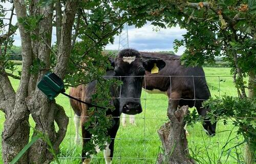

% 12 days of HPC highlights speed run
% Alex Coleman   Research Computing
% 14th December 2021

# Speed run commence!

# On the 1st day of christmas...

- Our [first post](https://arc.leeds.ac.uk/blog/twelvedayshpc2021-Dec01/) was from Laura Marsden 
- They're using HPC to study an alternate format for clinical trials called cluster randomisation

## 

# 3 french hens

- The [3rd post](https://arc.leeds.ac.uk/blog/twelvedayshpc2021-Dec03/) in our series was from Molly Gravett
- Her work is part of a large inter-Department research group studying the dynamics of tiny protein motors in our bodies

<figcaption>GIF from <a href="https://www.youtube.com/watch?v=wJyUtbn0O5Y">XVIVO Scientific animation</a></figcaption>

## 

<figcaption>GIF by Molly Gravett</a></figcaption>

# 

# 4 calling birds

- On day 4 of the series we had [a post](https://arc.leeds.ac.uk/blog/twelvedayshpc2021-Dec04/) from Serge Sharoff
- He is using the HPC to analyse social media data to identify users at risk from misinformation

# On the 6th day of christmas...

- Soffi Bi wrote the [6th post](https://arc.leeds.ac.uk/blog/twelvedayshpc2021-Dec06/) on using cutting hedge technology
- Her work with the HPC analyses 4,500 hours of birdsong recordings to identify bird calls

##

#

# 11 pipers piping

- On Day 11 we had [a post](https://arc.leeds.ac.uk/blog/twelvedayshpc2021-Dec11/) from David Santos-Carballal
- His work is looking at finding new catalysts for converting carbon dioxide

## 

# Thank you

## Check out the full stories

- Find the full stories and more blog posts from the 12 days of HPC series on [our blog](https://arc.leeds.ac.uk/blog/)
